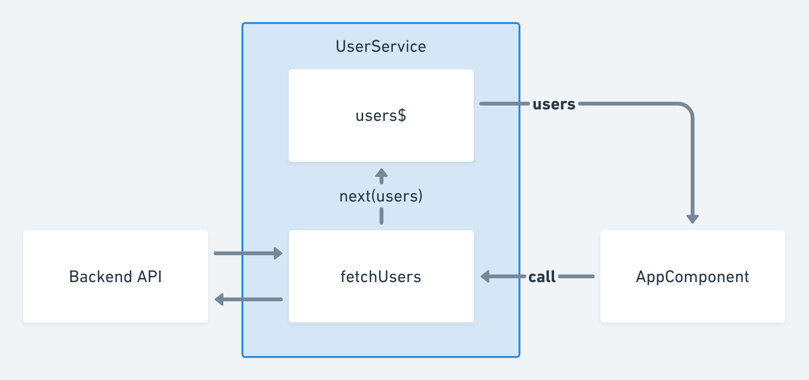

# サービスの作成と状態管理

前のページに引き続き、単一責任の原則に基づいて AppComponent が抱える責任を分離していきます。このページでは ユーザー配列の取得と、その状態の保持をAppComponentから取り除くことにしましょう。

### UserService

Angularの一般的なアプローチとして、コンポーネントからUIに関係しない処理は **サービス** に分離されます。Angularにおけるサービスという語彙は、特定の実装やインターフェースの名称ではなく、ある単一の関心のための作られた機能集約のことをまとめてサービスと呼びます。

まずはHTTP経由でユーザーの配列を取得する処理を、UserServiceに移譲しましょう。この処理をAppComponentから隠蔽することで、URLの変更やHTTPヘッダの追加のような原因でAppComponentが変更されることがなくなります。


```typescript
import { Injectable } from '@angular/core';
import { HttpClient } from '@angular/common/http';
import { User } from '../user';

@Injectable({ providedIn: 'root' })
export class UserService {

  constructor(private http: HttpClient) { }

  getUsers() {
    return this.http.get<User[]>('https://jsonplaceholder.typicode.com/users');
  }
}
```


そしてAppComponentではUserServiceをインジェクトして `getUsers` メソッドを呼び出すだけとなります。


```typescript
import { Component } from '@angular/core';
import { User } from './user';
import { UserService } from './service/user.service';

@Component({
  selector: 'my-app',
  templateUrl: './app.component.html',
  styleUrls: ['./app.component.css']
})
export class AppComponent {

  users: User[] = [];

  constructor(private userService: UserService) { }

  ngOnInit() {
    this.userService.getUsers().subscribe(users => {
      this.users = users;
    });
  }
}

```


AppComponentの責務がどんどん減ってきましたね。あともう少しです。

### RxJSによる状態管理

ユーザーリストを表示するための配列はAppComponentのクラスプロパティとして保持されています。この責任を UserService へ移譲しましょう。移譲するにあたり、UserServiceのメソッドを次のように整理します。

* `get users$(): Observable<User[]>`  ユーザーの配列の更新を通知するObservableを返すgetter
* `fetchUsers(): void` ユーザーの配列をフェッチするコマンド

この分離は、 **コマンド・クエリ分離原則** に従ったものになっています。この原則は、副作用を与えず結果だけを受け取る **クエリ** と、結果を返さず副作用だけを起こす **コマンド** を分離するものです。



現在の `getUsers()` はHTTPリクエストを発行する副作用がある一方で呼び出し元に結果も返しています。これを分離し、HTTPリクエストを発行してシステムの状態を書き換えるコマンドと、システムの状態を監視するクエリを作成します。

実際のユーザーの配列を保持するのは、RxJSの `BehaviorSubject` です。このSubjectは常にスナップショット可能な状態を保持できるため、シンプルな状態管理に最適です。ただしサービスの利用者には読み込み専用のObservableとしてのインターフェースだけを露出したいので、プライベートフィールドとgetterを使って実装します。


```typescript
import { Injectable } from '@angular/core';
import { HttpClient } from '@angular/common/http';
import { BehaviorSubject } from 'rxjs';
import { User } from '../user';

@Injectable({ providedIn: 'root' })
export class UserService {

  private _users$ = new BehaviorSubject<User[]>([]);

  get users$() {
    return this._users$.asObservable();
  }

  constructor(private http: HttpClient) { }

  fetchUsers(): void {
    this.http.get<User[]>('https://jsonplaceholder.typicode.com/users')
      .subscribe(users => {
        this._users$.next(users);
      });
  }
}
```


このサービスをAppComponentから利用すると次のようになります。注意すべきは、ユーザーの配列が同期的な配列からObservableに変わったので、テンプレート中でAsyncパイプを使って購読する点です。



```typescript
import { Component } from '@angular/core';
import { UserService } from './service/user.service';

@Component({
  selector: 'my-app',
  templateUrl: './app.component.html',
  styleUrls: ['./app.component.css']
})
export class AppComponent {

  users = this.userService.users$;

  constructor(private userService: UserService) { }

  ngOnInit() {
    this.userService.fetchUsers();
  }
}

```



```markup
<user-list [users]="users | async"></user-list>
```



ついに、UIとライフサイクルに関わる責務以外はすべてAppComponentから分離できました。



ところで、今のAppComponentとUserServiceの関係を図にすると次のようになります。よくみるとこれはビューとストア、アクションによる単方向のデータフローを構成しており、簡易的ではありますがFluxに近い実装となっています。



現在は管理する状態がユーザーの配列だけですが、アプリケーションの状態が増えるとUserServiceだけで管理することが単一責任の原則に反していきます。次のページからは少し複雑性が高くなっていくなかでのアプリケーション設計を学びましょう。

