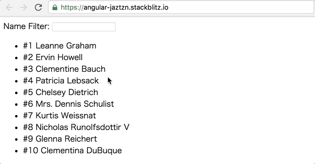

# フォームと状態管理

前のページではユーザーリストを表示するための配列をRxJSの `BehaviorSubject` で管理しました。このページでは、ユーザーリストにフィルター機能を追加する中での、少し複雑になった状態を管理する設計パターンについて見ていきましょう。

## 配列のフィルタリング

今回実装するユーザーリストのフィルタリングは、以下の要件を満たすものとします。

* フィルタリング用のテキストフィールドをひとつ表示する
* テキストフィールドに入力された文字列を名前に含むユーザーだけをリストに表示する
* フィルタリングはテキストフィールドの変更にリアルタイムに反応する

これを実現するために、アプリケーションが管理する状態の型を次のように定義します。`userList.items` にはユーザーの配列を保持します。名前でフィルタリングするための文字列は `userListFilter.nameFilter` に保持します。



```typescript
export interface UserListFilter {
  nameFilter: string;
}

export interface State {
  userList: {
    items: User[];
  };
  userListFilter: UserListFilter;
}
```



今後文字列以外にも年齢や性別のような属性でフィルタリングをおこなうような変更に備えるため、フィルタリングに関する状態は `userListFilter` に、ユーザーリストを表示するためのデータは `userList` に集約しています。

この状態を管理するためのStoreサービスを作成します。これまでは `UserService` がユーザーに関するデータ取得、状態の管理という責務を集約していましたが、アプリケーション全体の状態の管理をおこなうためのサービスを作り、そこに既存の状態管理も移譲します。

まずはアプリケーションの初期状態を定義します。 `state.ts` に `inistalState` 変数を宣言します。



```typescript
export const initialState = {
  userList: {
    items: [],
  },
  userListFilter: {
    nameFilter: '',
  }
};
```



### Store

状態管理をおこなうStoreサービスを作成します。状態を保持するための `BehaviorSubject` と、状態を更新するための `update` メソッド、そして状態を購読するための `select<T>` メソッドを実装しています。



```typescript
import { Injectable } from '@angular/core';
import { BehaviorSubject } from 'rxjs';
import { map } from 'rxjs/operators';
import { State, initialState } from '../state';

@Injectable({ providedIn: 'root' })
export class Store {

  private _state$ = new BehaviorSubject<State>(initialState);

  update(fn: (state: State) => State) {
    const current = this._state$.value;
    this._state$.next(fn(current));
  }

  select<T>(selector: (state: State) => T) {
    return this._state$.pipe(
      map(selector)
    );
  }
}
```



このStoreを使うように、`UserService` を変更します。 `AppComponent` から見た `UserService` のインターフェースは変えず、内部実装だけを変更します。これにより、状態管理の責務が `UserService` から切り離されます。同時に、`fetchUsers` メソッドは async関数を使いシンプルに書き直します。HTTPリクエストのObservableはリクエストが完了すると同時に自動でcompleteするため、Subscriptionを使ったキャンセルをしないのであればPromiseと大きな違いはありません。ここではコールバックネストを減らして可読性を高めるためにasync関数を利用しました。



```typescript
import { Injectable } from '@angular/core';
import { HttpClient } from '@angular/common/http';
import { BehaviorSubject } from 'rxjs';
import { Store } from './store.service';
import { User } from '../user';

@Injectable({ providedIn: 'root' })
export class UserService {

  get users$() {
    return this.store.select(state => state.userList.items);
  }

  constructor(private http: HttpClient, private store: Store) { }

  async fetchUsers() {
    const users = await this.http
      .get<User[]>('https://jsonplaceholder.typicode.com/users')
      .toPromise();

    this.store.update(state => ({
      ...state,
      userList: {
        ...state.userList,
        items: users,
      }
    }));
  }
}
```



### UserListUsecase

ここに、フィルタリングのための機能を追加していきます。ところで、`UserService` の責務はユーザーリストを表示するためのビジネスロジックを集約することですから、フィルタリングのための処理も `UserService` に記述します。ただし名前が実態に合っていないため、ここで名前を `UserListUsecase` に変更します。また次のように、フィルター条件をセットする `setNameFilter` メソッドを実装し、 `users$` ゲッターはフィルタリングを適用した結果の配列を返すように変更します。



```typescript
import { Injectable } from '@angular/core';
import { HttpClient } from '@angular/common/http';
import { BehaviorSubject } from 'rxjs';
import { filter } from 'rxjs/operators';
import { Store } from '../service/store.service';
import { User } from '../user';

@Injectable({ providedIn: 'root' })
export class UserListUsecase {

  get users$() {
    return this.store.select(state =>
      state.userList.items.filter(user => user.name.includes(state.userListFilter.nameFilter))
    );
  }

  get filter$() {
    return this.store.select(state => state.userListFilter);
  }

  constructor(private http: HttpClient, private store: Store) { }

  async fetchUsers() {
    const users = await this.http
      .get<User[]>('https://jsonplaceholder.typicode.com/users')
      .toPromise();

    this.store.update(state => ({
      ...state,
      userList: {
        ...state.userList,
        items: users,
      }
    }));
  }

  setNameFilter(nameFilter: string) {
    this.store.update(state => ({
      ...state,
      userListFilter: {
        nameFilter
      }
    }));
  }
}
```



## フィルターの追加

必要なビジネスロジックが揃ったので、ビューの変更をおこないましょう。フィルタリング設定のフォームを表示するための `UserListFilterComponent` を作成します。テンプレートはReactve Formにひとつのinput要素だけがあるシンプルはフォームです。コンポーネントクラスでは、Inputとして渡された状態をフォームにセットし、フォームの更新をOutputで親クラスに通知しています。フォームの入力値が更新されるたびに `valueChange` Outputのイベントが発火します。



```markup
<form [formGroup]="form">

    <label>
    Name Filter:
    <input formControlName="nameFilter" >
  </label>

</form>
```



```typescript
import { Component, Input, Output, EventEmitter, OnDestroy } from '@angular/core';
import { FormBuilder, FormGroup } from '@angular/forms';
import { takeUntil } from 'rxjs/operators';
import { UserListFilter } from '../../state';

@Component({
  selector: 'user-list-filter',
  templateUrl: './user-list-filter.component.html',
  styleUrls: ['./user-list-filter.component.css']
})
export class UserListFilterComponent implements OnDestroy {
  @Input() set value(value: UserListFilter) {
    this.setFormValue(value);
  }
  @Output() valueChange = new EventEmitter<UserListFilter>();

  form: FormGroup;

  private onDestroy = new EventEmitter();

  constructor(private fb: FormBuilder) {
    this.form = this.fb.group({
      nameFilter: ['']
    });
    this.form.valueChanges.pipe(takeUntil(this.onDestroy)).subscribe(value => {
      this.valueChange.emit(value);
    });
  }

  ngOnDestroy() {
    this.onDestroy.complete();
  }

  private setFormValue(value: UserListFilter) {
    this.form.setValue(value);
  }
}
```



`AppComponent` を変更し、`UserListFilterComponent` とのコミュニーケーションをおこないます。フォームから発火されたフィルター条件の更新は、`UserListUsecase` 経由で保存され、ユーザーリストの表示に影響します。



```markup
<user-list-filter 
  [value]="userListFilter$ | async" 
  (valueChange)="setUserListFilter($event)">
</user-list-filter>
<user-list [users]="users$ | async"></user-list>
```



```typescript
import { Component } from '@angular/core';
import { HttpClient } from '@angular/common/http';
import { User } from './user';
import { UserListFilter } from './state';
import { UserListUsecase } from './usecase/user-list.usecase';

@Component({
  selector: 'my-app',
  templateUrl: './app.component.html',
  styleUrls: ['./app.component.css']
})
export class AppComponent {

  users$ = this.userList.users$;
  userListFilter$ = this.userList.filter$;

  constructor(private userList: UserListUsecase) { }

  ngOnInit() {
    this.userList.fetchUsers();
  }

  setUserListFilter(value: UserListFilter) {
    this.userList.setNameFilter(value.nameFilter);
  }
}
```



これでユーザーリストのフィルタリング機能が実装できました。



このページでは以下のように設計と実装をおこないました。

* 要件に必要なアプリケーションの状態を型として定義しました
  * フィルタリングの仕様変更を考慮し、ユーザーの配列とフィルター条件の状態を分離しました
* アプリケーションの初期状態を定義しました
* 状態管理だけをおこなう Store を作成し、 `UserService` から責務を切り離しました
* `UserService` を `UserListUsecase` にリネームし、フィルタリングに関するビジネスロジックを集約しました
* `UserListFilterComponent` を作成し、リアクティブフォームを使ってInput/Outputベースのフォームを実装しました



アプリケーションの基本的な構成が固まってきました。次の最後のページでは、ユーザーの詳細画面へルーティングする機能を実装し、複数ページにおける設計パターンを見ていきます。

